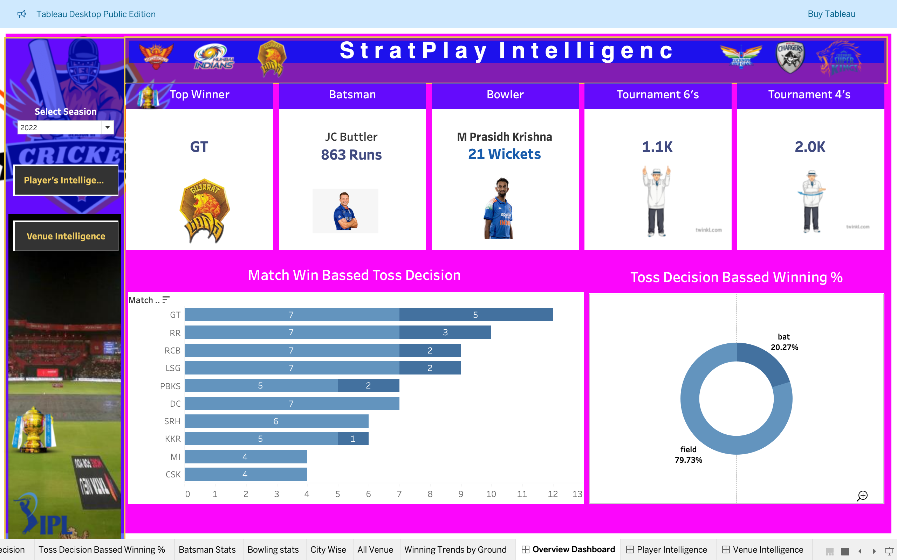
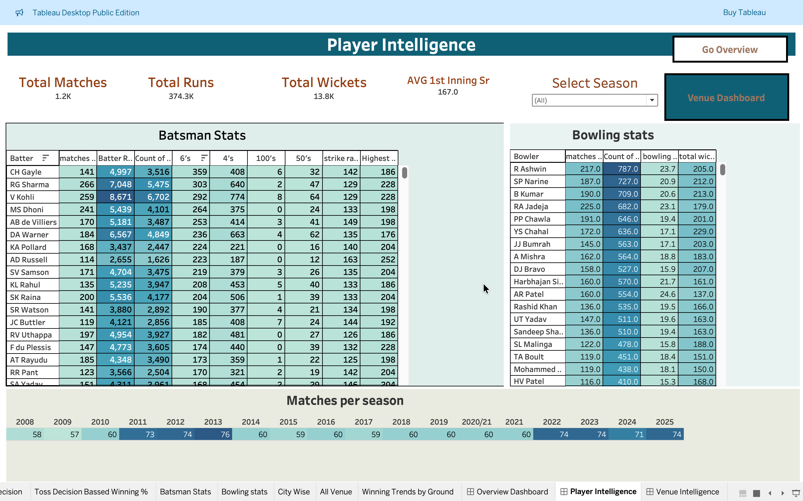
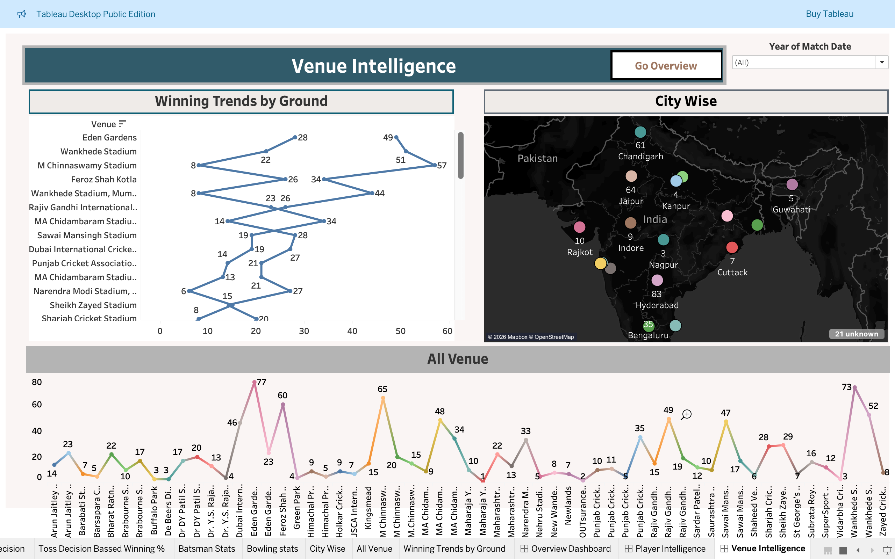

# 🏏 StratPlay Intelligence Dashboard (Hackathon Project)

## 📌 Project Overview

StratPlay Intelligence is a data analytics dashboard built using Tableau
to analyze IPL match data and generate actionable insights for teams,
analysts, and fans.

------------------------------------------------------------------------

## 🎯 Problem Statement

In modern cricket analytics, teams struggle to extract meaningful
insights from large datasets such as match results, player stats, and
venue performance.

------------------------------------------------------------------------

## 💡 Solution

We built an interactive Tableau dashboard that: - Analyzes match
outcomes - Evaluates player performance - Identifies winning
strategies - Provides venue-based insights

------------------------------------------------------------------------

## 📊 Key Features

### 🔹 Match Insights

-   Total Matches Played
-   Win % (Batting First vs Chasing)
-   Toss Impact Analysis
-   Average First Innings Score

### 🔹 Player Analytics

-   Top Run Scorers
-   Strike Rate Comparison
-   Wicket Leaders

### 🔹 Venue Intelligence

-   Average Score per Venue
-   Winning Trends by Stadium

------------------------------------------------------------------------

## 🛠️ Tech Stack

-   Tableau Public / Tableau Desktop
-   Excel / CSV Dataset
-   Data Cleaning & KPI Design

------------------------------------------------------------------------

## 📸 Dashboard Preview

### 🔹 Overview Dashboard

  

### 🔹 Player Intelligence Dashboard

  

### 🔹 Venue Intelligence Dashboard

  

------------------------------------------------------------------------

## 📁 Project Structure

StratPlay-Intelligence/ │ ├── stratplay intelligence final
dashboard.twbx ├── README.md ├── images/ ├── dataset/ └── docs/

------------------------------------------------------------------------

## 🚀 How to Run

1.  Download the [text](<../../../Volumes/manish mac/syskriti ducs /stratplay intelligence final dashboard/stratplay intelligence final dashboard.twbx>) file
2.  Open in Tableau Public/Desktop
3.  Explore dashboards and filters

------------------------------------------------------------------------

## 👥 Team Contribution

-   Data Cleaning
-   KPI Development
-   Dashboard Design
-   Presentation

------------------------------------------------------------------------

## 🔮 Future Scope

-   AI-based match prediction
-   Real-time data integration
-   Advanced player analytics

------------------------------------------------------------------------

## 📧 Contact

Manish Kumar
